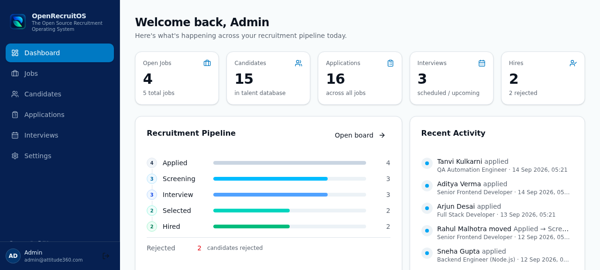
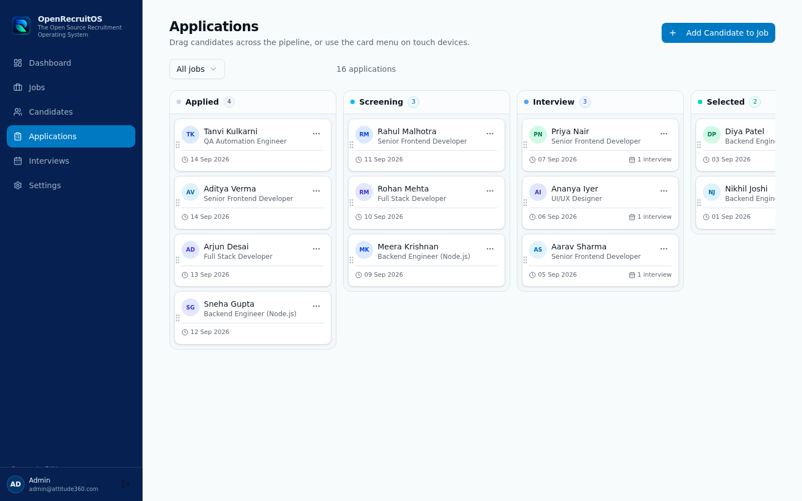
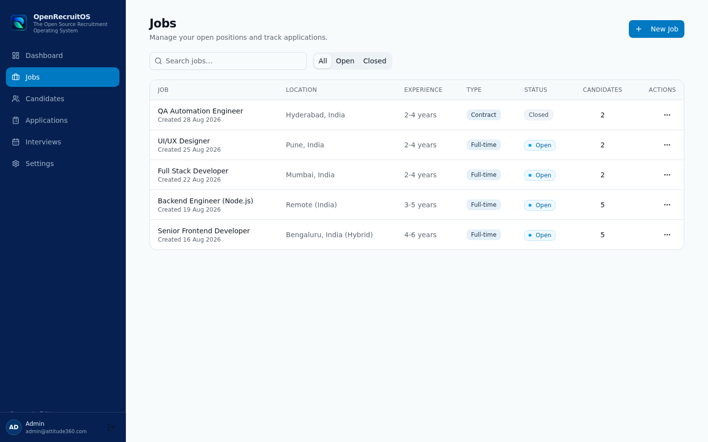
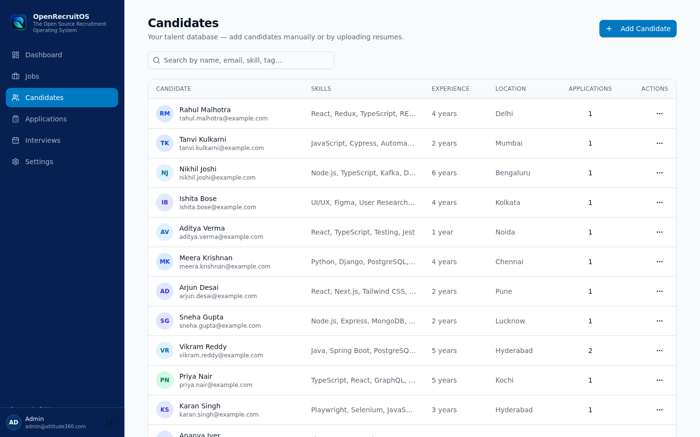
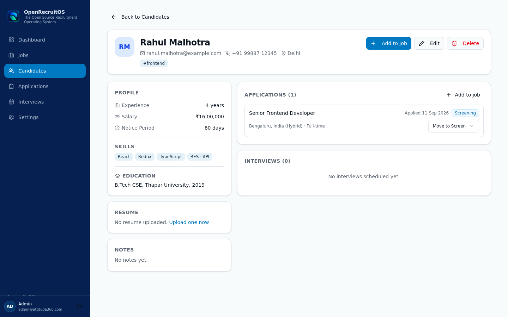
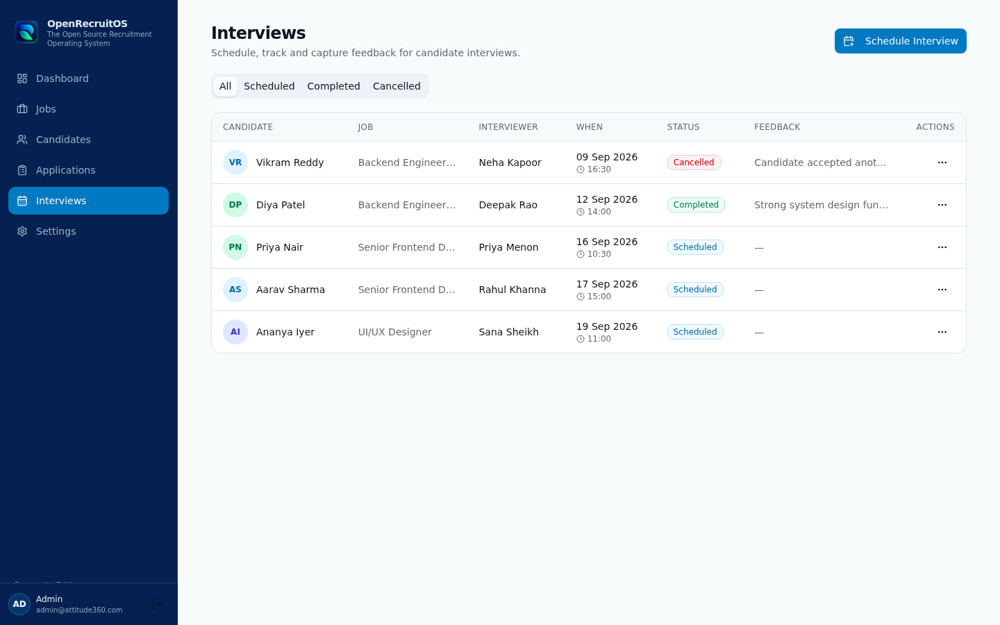
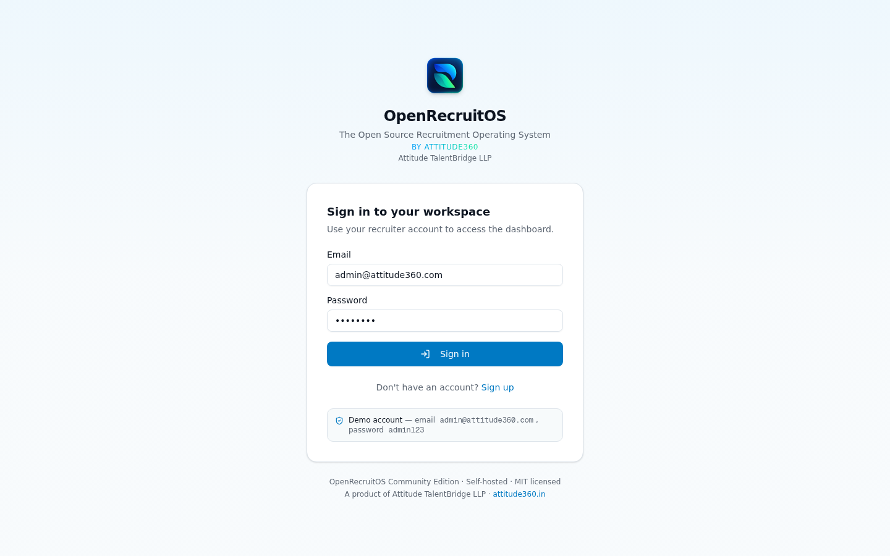
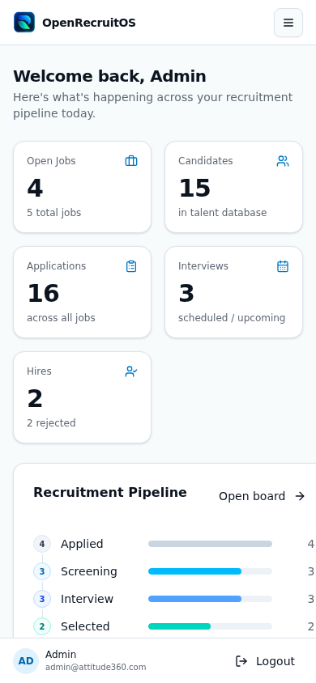
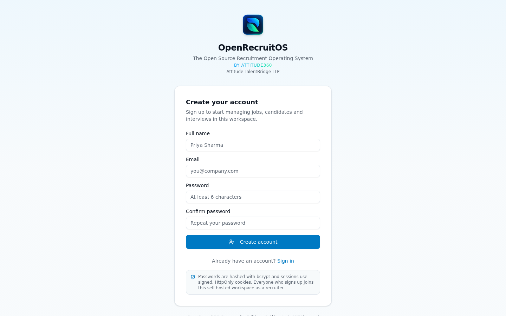
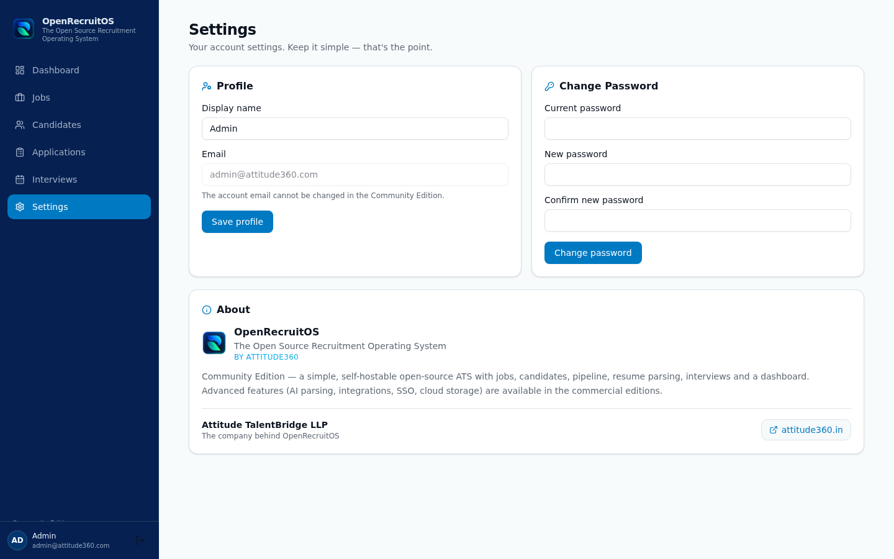

# OpenRecruitOS

**The Open Source Recruitment Operating System**

*By Attitude360 — a product of Attitude TalentBridge LLP · [attitude360.in](https://attitude360.in)*

OpenRecruitOS **Community Edition** is a simple, modern, self-hostable open-source **Applicant Tracking System (ATS)**. It is intentionally small and focused — six core modules, no enterprise bloat:

1. **Job Management** — create, edit, open/close and delete jobs
2. **Candidate Management** — profiles, resumes, skills, notes & tags
3. **Application & Pipeline** — Kanban board with stage history
4. **Basic Resume Parsing** — PDF / DOC / DOCX upload with field extraction (no AI)
5. **Basic Interview Management** — schedule, complete, cancel, feedback
6. **Basic Dashboard** — headline stats, pipeline overview, recent activity

> Simple → Fast → Clean → Usable

---

## Screenshots

| Dashboard | Applications Kanban |
| --- | --- |
|  |  |

| Jobs | Candidates |
| --- | --- |
|  |  |

| Candidate Profile | Interviews |
| --- | --- |
|  |  |

| Sign in | Mobile |
| --- | --- |
|  |  |

<details>
<summary>More screenshots</summary>

| Sign up | Settings & About |
| --- | --- |
|  |  |

</details>

---

## Tech Stack

| Layer     | Technology                                      |
| --------- | ----------------------------------------------- |
| Frontend  | Next.js (App Router), TypeScript, Tailwind CSS, shadcn/ui |
| Backend   | Node.js runtime, TypeScript, REST API routes    |
| Database  | SQLite (default) or PostgreSQL — via Prisma ORM |
| Auth      | Session cookie (JWT) + bcrypt password hashing  |
| Files     | Local storage driver behind a pluggable interface |
| Deployment| Docker + Docker Compose                         |

---

## Quick Start (Docker)

```bash
git clone <repository>
cd openrecruitos
docker compose up -d
```

Open **http://localhost:3000** and sign in with the seeded demo account:

| Email                   | Password  |
| ----------------------- | --------- |
| `admin@attitude360.com` | `admin123`|

Demo data (5 jobs, 15 candidates, applications across every pipeline stage, 3 hires, 5 interviews) is seeded automatically on first start. Set `SEED_DEMO_DATA=false` to skip it.

### PostgreSQL setup

The default compose file uses SQLite (zero external services). To run with PostgreSQL:

```bash
docker compose -f docker-compose.postgres.yml up -d
```

This builds the same app against the PostgreSQL Prisma datasource and starts a `postgres:16` container.

---

## Install & Run Locally (without Docker)

**Prerequisites:** [Node.js 20+](https://nodejs.org) (or [Bun](https://bun.sh)) and npm / bun / pnpm. No external database needed — SQLite is the default and the file is created automatically.

```bash
# 1. Clone the repository
git clone https://github.com/<your-username>/openrecruitos.git
cd openrecruitos

# 2. Install dependencies
npm install          # or: bun install / pnpm install

# 3. Create your environment file
cp .env.example .env # defaults are fine for local development

# 4. Create the database schema
npm run db:push

# 5. Start the development server
npm run dev          # or: bun run dev
```

Open **http://localhost:3000**.

**First run:** demo data (admin account, 5 jobs, 15 candidates, applications,
interviews) is **seeded automatically** the first time the dev server starts
against an empty database (`SEED_DEMO_DATA=true` in `.env.example`). You can
also seed manually with `bun run db:seed` (requires Bun), or skip demo data by
setting `SEED_DEMO_DATA=false` — then just use **Sign up** to create your own
account.

Sign in with the demo account:

| Email                   | Password   |
| ----------------------- | ---------- |
| `admin@attitude360.com` | `admin123` |

### Available scripts

| Command             | Description                                       |
| ------------------- | ------------------------------------------------- |
| `npm run dev`       | Start the development server (auto-seeds if empty)|
| `npm run build`     | Production build (standalone output)              |
| `npm run start`     | Start the production server                       |
| `npm run lint`      | Run ESLint                                        |
| `npm run db:push`   | Push the Prisma schema to the database            |
| `npm run db:seed`   | Seed demo data manually (requires Bun)            |

> **Switching to PostgreSQL locally:** change the datasource provider in
> `prisma/schema.prisma` to `postgresql` (a ready-made copy lives at
> `prisma/schema.postgres.prisma`), point `DATABASE_URL` at your Postgres
> instance and run `npm run db:push`.

---

## Accounts & Sign Up

There are two ways to get an account, depending on how you deployed:

1. **First-run setup (fresh instance).** Deploy with an empty database and open the app —
   OpenRecruitOS detects that no accounts exist and shows a *“Set up your workspace”* screen.
   The first account you create acts as your admin/recruiter account.
2. **Open sign-up.** The sign-in page has a **Sign up** link. Teammates can create their own
   recruiter accounts (name + email + password) and immediately join the same workspace.
   Passwords are hashed with bcrypt; sessions are signed JWTs in HttpOnly cookies.
3. **Demo seed.** `bun run db:seed` (or the Docker entrypoint with `SEED_DEMO_DATA=true`)
   creates the demo account `admin@attitude360.com` / `admin123` plus sample data.

> All accounts in the Community Edition are equal recruiters in a single workspace —
> there are intentionally no roles or permission levels. Fine-grained RBAC, invites and
> SSO are reserved for the commercial editions.

---

## The Core Workflow

The full recruitment loop works end-to-end:

```
Login → Create Job → Create Candidate → Upload Resume → Parse Resume
  → Review Candidate → Apply to Job → Applied → Screening → Interview
  → Schedule Interview → Complete Interview → Feedback → Selected → Hired
```

Also supported: **reject a candidate** (separate terminal stage) and **close a job**.

Candidates can be moved through the pipeline by **drag & drop** on the Kanban
board (desktop) or via the card menu / stage dropdowns (touch-friendly).

---

## Project Structure

```
src/
  app/
    page.tsx                 # Single-page app shell (login + all views)
    api/                     # REST API (route handlers)
      auth/                  #   login / logout / me / password
      jobs/                  #   /api/jobs, /api/jobs/:id
      candidates/            #   /api/candidates, /api/candidates/:id
      candidates/parse-resume/ #  upload + basic parsing
      applications/          #   /api/applications, /api/applications/:id (stage moves + history)
      interviews/            #   /api/interviews, /api/interviews/:id
      dashboard/             #   stats + pipeline counts + recent activity
      resumes/               #   authenticated resume download
  components/                # UI views & shared building blocks
  lib/
    auth.ts                  # JWT session + bcrypt helpers
    storage.ts               # StorageDriver interface + local driver (S3-ready)
    resume-parser.ts         # ResumeParser interface + basic (non-AI) parser
    constants.ts             # stages, statuses, employment types
    client.ts                # typed API client
prisma/
  schema.prisma              # SQLite datasource (default)
  schema.postgres.prisma     # PostgreSQL datasource (drop-in swap)
scripts/
  seed.ts                    # demo data seeder
Dockerfile                   # multi-stage build (sqlite | postgresql)
docker-compose.yml           # SQLite, single container
docker-compose.postgres.yml  # App + PostgreSQL
```

---

## Database Model

Six entities, deliberately minimal:

- **User** — account, bcrypt-hashed password
- **Job** — title, description, skills, experience, location, salary, employment type, status (Open/Closed)
- **Candidate** — profile, resume file reference, skills, experience, education, notes, tags
- **Application** — candidate ↔ job, current stage, status, applied date
- **ApplicationHistory** — every stage change (`previousStage → newStage`)
- **Interview** — application, interviewer, date/time, status (Scheduled/Completed/Cancelled), feedback

Pipeline stages: `Applied → Screening → Interview → Selected → Hired`, with `Rejected` as a separate terminal stage.

---


## Security Notes

- Passwords are hashed with **bcrypt**; sessions use signed **JWT** cookies
  (`HttpOnly`, `SameSite=Lax`).
- All API routes require an authenticated session; resume downloads are
  access-controlled and guarded against path traversal.
- Set a strong `JWT_SECRET` in production (see `.env.example`).
- Runs behind HTTPS in production? Flip `secure: true` on the session cookie in
  `src/lib/auth.ts`.

## License

Open source — Community Edition by Attitude360.

OpenRecruitOS is developed and maintained by **Attitude TalentBridge LLP** ·
[attitude360.in](https://attitude360.in)
